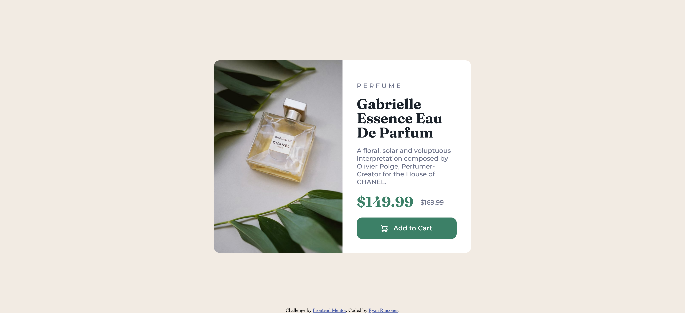

# Frontend Mentor - Product preview card component solution

This is a solution to the [Product preview card component challenge on Frontend Mentor](https://www.frontendmentor.io/challenges/product-preview-card-component-GO7UmttRfa). Frontend Mentor challenges help you improve your coding skills by building realistic projects. 

## Table of contents

- [Overview](#overview)
  - [The challenge](#the-challenge)
  - [Screenshot](#screenshot)
  - [Links](#links)
- [My process](#my-process)
  - [Built with](#built-with)
  - [What I learned](#what-i-learned)
  - [Continued development](#continued-development)
  - [Useful resources](#useful-resources)
- [Author](#author)
- [Acknowledgments](#acknowledgments)

**Note: Delete this note and update the table of contents based on what sections you keep.**

## Overview

### The challenge

Users should be able to:

- View the optimal layout depending on their device's screen size
- See hover and focus states for interactive elements

### Screenshot



### Links

- Solution URL: [Frontend Mentor](https://www.frontendmentor.io/solutions/product-preview-card-component-eTtZbHvEwz)
- Live Site URL: [GitHub Pages Live Site](https://rrincones.github.io/product-preview-card-component/)

### Built with

- Semantic HTML5 markup
- CSS custom properties
- Flexbox

### What I learned

I primarily learned how to design a responsive page by using the picture element and a CSS at-rule. Specifically, I learned the syntax of at-rules, that they begin with an @ followed by an identifier, and how to implement a media query within the @media at-rule. Additionally, I learned how to select images in CSS within the <picture> element. Selecting just the  affects all the images inside, but nesting that rule inside the appropriate @media rule allows for the selection of a specific image. And if you want to select one image from among several <picture> elements, and that load together, you can use a class or id selector. More importantly, I discovered that the picture element is a good solution to give the browser several image formats and sizes to choose from that will fit the device or browser being used. Not all browsers support all formats and smaller images need to be used on smaller screen sizes. 

```html
<picture>
  <source media="(max-width: 50rem)" srcset="images/image-product-mobile.jpg">
  
</picture>
```
```css
@media (max-width: 50rem) {
   img {
     float: none;
     border-radius: 0.75rem 0.75rem 0 0;
     width: 100%;
   }

   main {
    width: 80%;
    margin: 2rem auto 2rem;
   }

   .padding {
    width: 100%;
    display: block;
    padding: 2rem;
    }
}
```
### Continued development

This is the first project in which I made a responsive design for mobile devices. My aim is to hone these skills further from one project to the next and to apply the tips I received from helpful developers within the Frontend Mentor Slack community. I know now that I should generally avoid setting exact heights or any height at all on container elements as the content needs to be able to grow and adapt to the various screen sizes without overflow and such. Exact dimensions means no room for adaptation, so I'll think more about not using those moving forward. I'll also think more about accommodating as many users as possible and their different ways of browsing the Web. Some things I didn't consider were how a user browsing on a mobile device in landscape view or changing the base font size might affect my design. I must design for everyone as best I can and keep these things in mind. 

### Useful resources

 These articles helped me learn how to center absolutely positioned elements. 

- [thoughtbot](https://thoughtbot.com/blog/positioning) 
- [Frontend Weekly](https://medium.com/front-end-weekly/absolute-centering-in-css-ea3a9d0ad72e)

## Author

- Frontend Mentor - [@rrincones](https://www.frontendmentor.io/profile/rrincones)

## Acknowledgments
